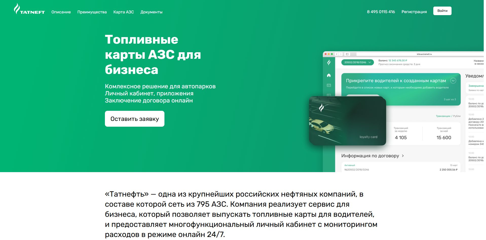
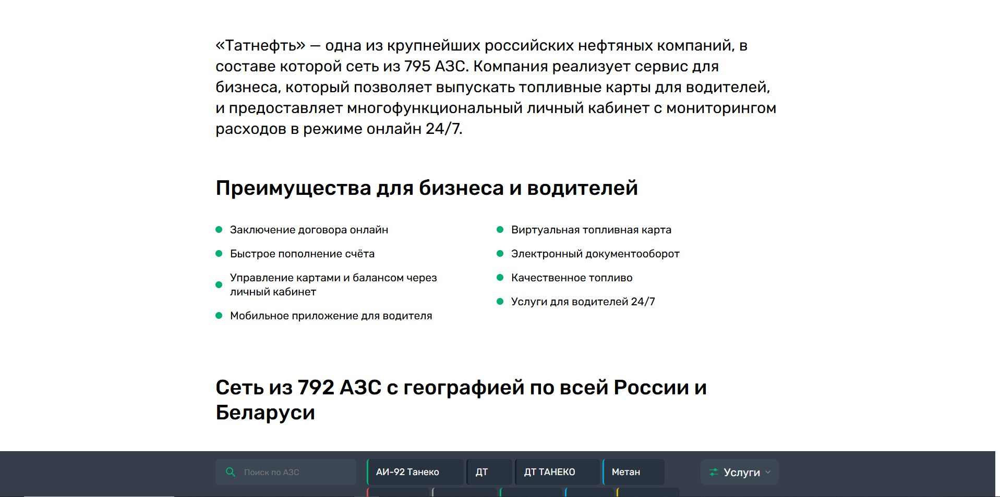
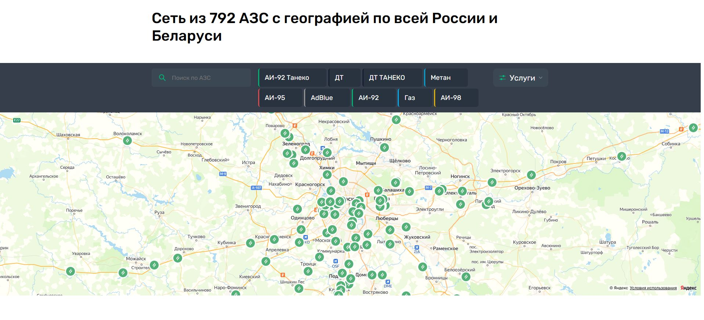
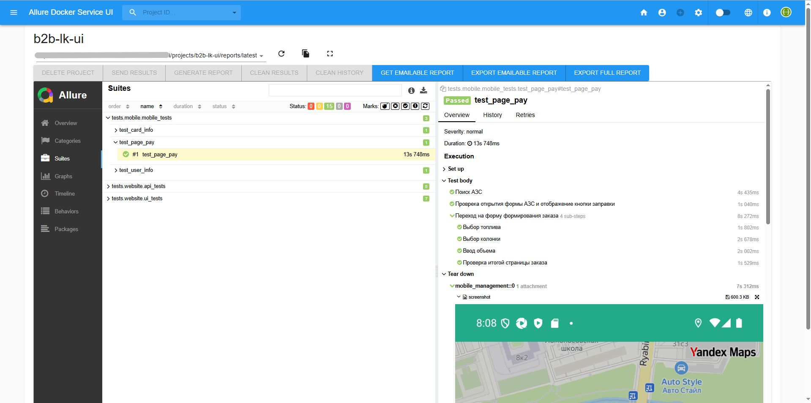

## Автотесты Web/Mobile по проекту "Топливные карты АЗС для бизнеса"
[Ссылка на сайт "Топливные карты АЗС для бизнеса"](https://lk.gsb.tatneft.ru/promo/)

___

## Список кейсов по тестированию (UI-тесты)
.../tests/website/ui_tests
1. Авторизация и переход в настройки личного кабинета (test_authorization.py)
2. Создание учетной записи для водителя (test_create_driver.py)
3. Сохранение транспорта (test_create_transport.py)
4. Создание учетной записи для оператора (test_create_operator.py)
5. Создание ограничителя для топливной карты (test_cteate_card_limit.py)
6. Создание группы для управления топливными картами (test_create_group_card.py)
7. Добавление топливных карт в группу для единого управления ограничителями (test_add_card_in_group.py)

## Список кейсов по тестированию (API-тесты)
.../tests/website/api_tests
1. Запрос информации о компании юзера (test_company_info.py)
2. Запрос информации о контракте юзера (test_contract_info.py)
3. Запрос на формирование отчета по транзакциям (test_order_report.py)
4. Запрос на удаление водителя (test_add_delete_driver_in_card.py)
5. Запрос на удаление транспорта (test_add_delete_transport_in_card.py)

## Список кейсов по тестированию (MOBILE-тесты)
.../tests/mobile/mobile_tests
1. Переход в личный кабинет водителя (test_user_info.py)
2. Переход в раздел с информацией по топливной карте (test_card_info.py)
3. Оформление заказа, переход на страницу оплаты (test_page_pay.py)

___

## Используемый стек:

___

## Пример Allure-отчета (Web)

### Запись прохождения (Web):
video

___
## Пример Allure-отчета (Mobile)

### Запись прохождения (Mobile):
video
___

## Оповещения в Telegram
telegram