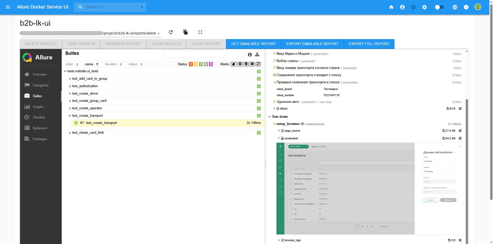

## Автотесты Web/Mobile по проекту "Топливные карты АЗС для бизнеса"
[Ссылка на сайт "Топливные карты АЗС для бизнеса"](https://lk.gsb.tatneft.ru/promo/)


___

## Список кейсов по тестированию (UI-тесты)
.../tests/website/ui_tests
1. Авторизация и переход в настройки личного кабинета (test_authorization.py)
2. Создание учетной записи для водителя (test_create_driver.py)
3. Сохранение транспорта (test_create_transport.py)
4. Создание учетной записи для оператора (test_create_operator.py)
5. Создание ограничителя для топливной карты (test_cteate_card_limit.py)
6. Создание группы для управления топливными картами (test_create_group_card.py)
7. Добавление топливных карт в группу для единого управления ограничителями (test_add_card_in_group.py)

## Список кейсов по тестированию (API-тесты)
.../tests/website/api_tests
1. Запрос информации о компании юзера (test_company_info.py)
2. Запрос информации о контракте юзера (test_contract_info.py)
3. Запрос на формирование отчета по транзакциям (test_order_report.py)
4. Запрос на удаление водителя (test_add_delete_driver_in_card.py)
5. Запрос на удаление транспорта (test_add_delete_transport_in_card.py)

## Список кейсов по тестированию (MOBILE-тесты)
.../tests/mobile/mobile_tests
1. Переход в личный кабинет водителя (test_user_info.py)
2. Переход в раздел с информацией по топливной карте (test_card_info.py)
3. Оформление заказа, переход на страницу оплаты (test_page_pay.py)

___

## Используемый стек:
<a href="https://github.com/allure-framework">
 
</a>

<a href="https://github.com/pytest-dev">

</a>

<a href="https://www.python.org/downloads/">

</a>

<a href="https://github.com/yashaka/selene">

</a>

<a href="https://github.com/aerokube/selenoid">

</a>

<a href="https://web.telegram.org/a/">

</a>

<a href="https://appium.io/docs/en/2.1/intro/requirements/">

</a>

<a href="https://developer.android.com/studio?hl=ru">

</a>


___

## Запуск автотестов (WEB/API/MOBILE)
### Локально (web/api)

* В проекте создать: 

файл .env c данными
```
WEB_LOGIN = "xxx"
WEB_PASS = "xxx"
SWAGGER_URL = "xxx"
WEB_URL = "xxx"
ID_COMPANY = "xxx"
ID_CONTRACT = "xxx"
ID_CARD = "xxx"
ID_DRIVER_FOR_CARD = "xxx"
ID_TRANSPORT_FOR_CARD = "xxx"
SELENOID_URL = "xxx"
```
файл .env.allure_server c данными
```
ALLURE_LOGIN = "xxx"
ALLURE_PASS = "xxx"
ALLURE_URL_WEB = "xxx"
ALLURE_URL_SWAGGER = "xxx"
ALLURE_ID_PROJECT = "xxx"
```
файл .env.mobile c данными
```
MOBILE_URL = "***"
APP = ***.apk
DEVICE_NAME = "***"
```

* Запустить команду для установки библиотек
```
Pip install –r requirements.txt
```
* Установить интерпритатор (через консоль или pycharm)
```
python -m venv .venv
source .venv/bin/activate
```
* Запуск теста:

website
```
pytest tests/website/ui_tests
```
api
```
pytest tests/website/api_tests
```
mobile
```
pytest tests/mobile/mobile_tests
```

* Вывод результатов на allure сервере
```
http://***/allure-docker-service-ui/projects/***
```

### Локально (mobile)

* Установить appium, node.js, android studio
* В android studio создать эмулятор android
* перед запуском тестов в консоли запустить applium и запустить эмулятор в android studio
```
applium
```
* запуск тестов
```
pytest tests/mobile/mobile_tests
```

## Пример Allure-отчета (Web)



___

## Пример Allure-отчета (Api)


___

## Пример Allure-отчета (Mobile)


___

## Оповещения в Telegram
telegram